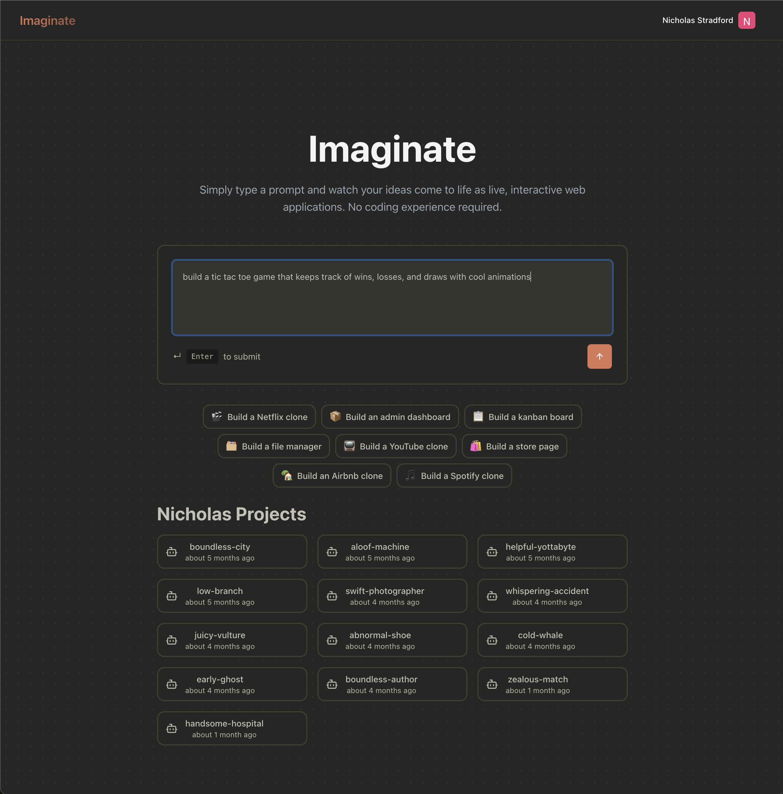
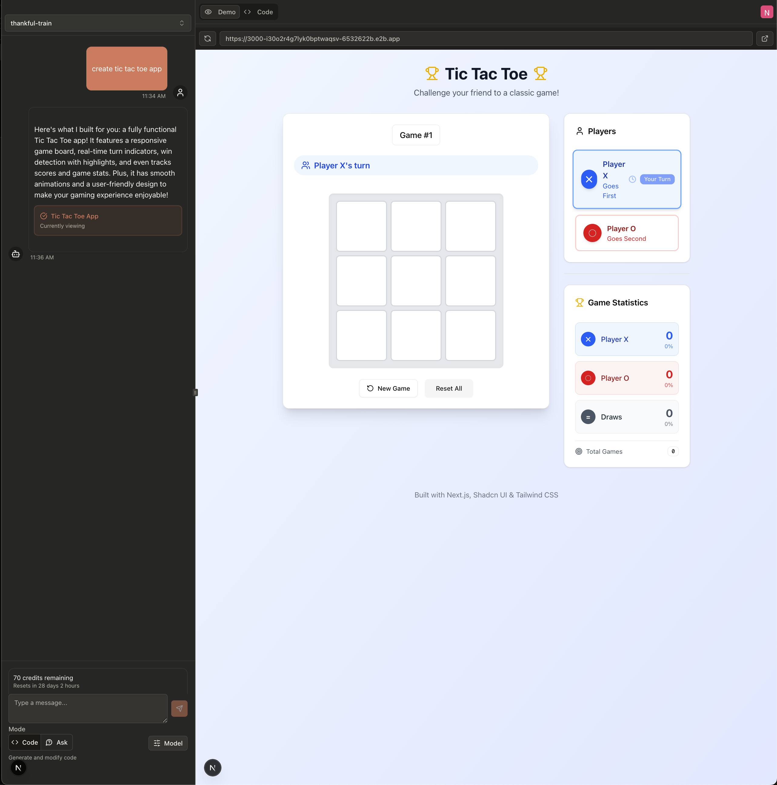
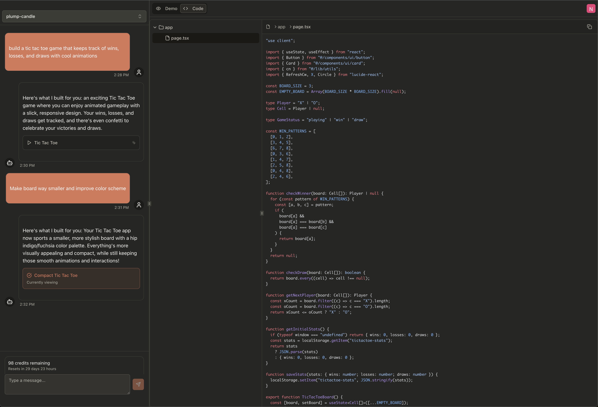

# Imaginate

Imaginate(imaginate.run) is a vibe coding web app. It allows users to chat with

## Getting Started

First, run the development server:

```bash
npm run dev
# or
yarn dev
# or
pnpm dev
# or
bun dev
```

## Screenshots

### Landing Page(Tic-tac-toe question)



### Chat Page App View(Tic-tac-toe app)



### Chat Page Code View(Tic-tac-toe app)



### Technology Used

This application uses OpenAI models for agent logic, E2B for sandboxes to run code in,
Inngest to make long running task async, and clerk for authentication and payments.
The webapp is made with Next.js and Shadcn primarily.
